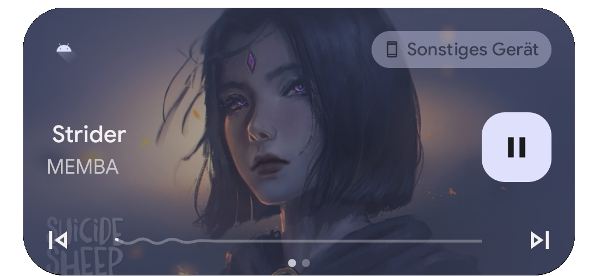
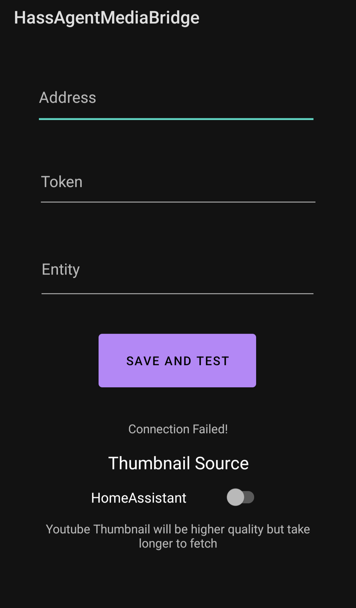

# HassAgentMediaBridge  

Simple App that connects Hass Agent MediaPlayer to Android Media Notification

  

Features:
-
- Links Media Controls (Play / Pause / Skip / Previous)
- Shows Media Progress (Hass Agent progress not always accurate)
- Displays Media Thumbnail (Directly from Hassio / or optionally first Thumbnail from YouTube)
- Disappears after not playing video for 15 minutes
 
Configuration
-

You need to have Hass Agent installed on one device as well as have the current Hass Agent integration enabled

Download the APK, and install it. (It may not work on older android devices, as I did not bother with backwards compatibility)

You will find 3 Input fields
- Endpoint - The host where your Hassio Instance is available (should look like this: "https://myhomeassistant.com")
- Token - Hassio Authentication Token (You can create one in your Hassio User settings)
- Entity - your mediaplayer entity (e.g. "media_player.my_pc") 

Press "Save and Test" to validate that it works.
(This just checks if the endpoint and token are valid, please double-check your entity id if it doesn't work)

Finally, the Thumbnail switch, HassAgent provides a thumbnail, but it is very low quality, so you can switch to use the first YouTube thumbnail result, as cover art. This takes a second and may bother some people.

# The App:

